# 上车助手

帮你管理快手直播小黄车的 Windows 工具——**录播**可以定时自动上下车，**真人直播**可以手动控车、回弹幕、看数据，一个软件都能搞定。

## 下载安装

👉 **[点击下载最新版](https://github.com/JLinMr/ks-shangche-releases/releases/latest)**

- 支持 Windows 10 / 11（64 位）
- 需要联网（激活和快手功能都要用网）
- 老用户打开软件后，标题栏会提示有新版本

## 适合谁用？

| 你怎么播 | 上车助手能帮你什么 |
|---------|----------------|
| **录播**（播提前录好的视频） | 提前排好上下车时间，开播后自动执行，不用人一直盯着点 |
| **真人直播** | 在货架页随时上车、下车、讲解，跟播助手看弹幕、快捷回复 |
| **多个账号** | 同时登录多个快手号，分别看订单和销售情况 |
| **下播复盘** | 查订单、看汇总，按时间段统计卖了多少钱、退了多少 |

> **重要：** 工作台里的「时间节点」功能，只适合**录播**。真人直播口播节奏会变，请手动操作，不要依赖定时自动执行。

## 快速上手

### 第一步：激活

安装后打开软件，输入激活码即可使用。激活码请联系文末索取。

### 第二步：登录快手账号

1. 打开**工作台**，点「扫码登录」
2. 用手机快手扫码，把账号加进来
3. 左侧能看到各账号的观看、订单、销售额；如果显示失效，重新扫码即可

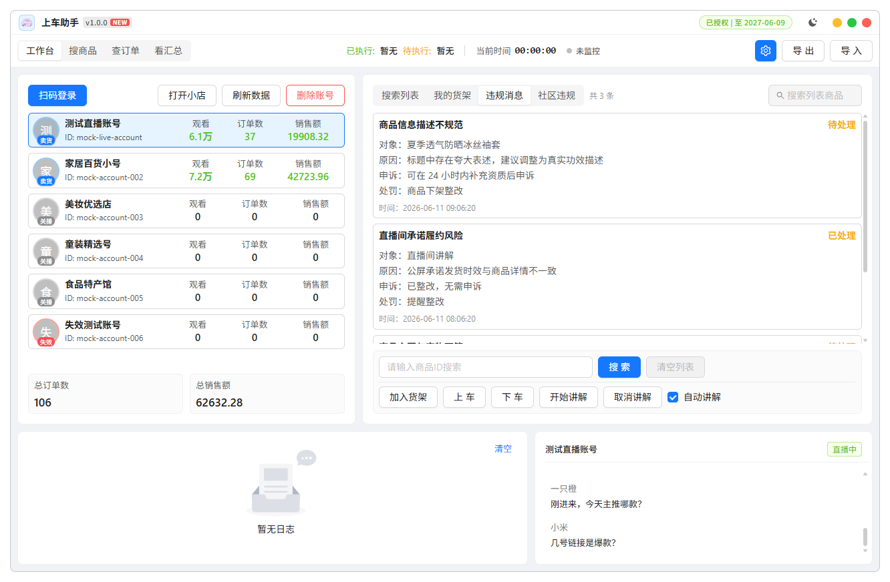

### 第三步：按你的直播方式操作

**如果你是录播：**

1. 在「搜商品」里找到要卖的商品，记下商品 ID
2. 回到工作台，按视频节奏添加时间节点（几点上车、几点下车、几点讲解）
3. 开播后点「开始监控」，软件会按你排好的时间自动操作

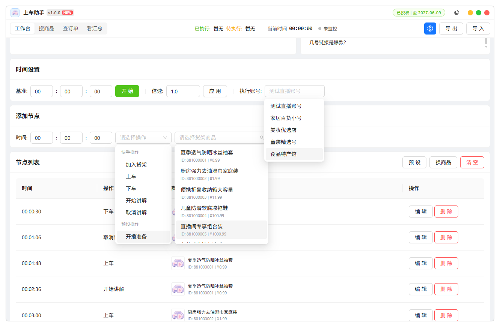

**如果你是真人直播：**

1. 开播后打开「我的货架」
2. 搜商品 ID，需要卖哪个就点「上车」「下车」「开始讲解」
3. 打开「跟播助手」看弹幕、回复观众

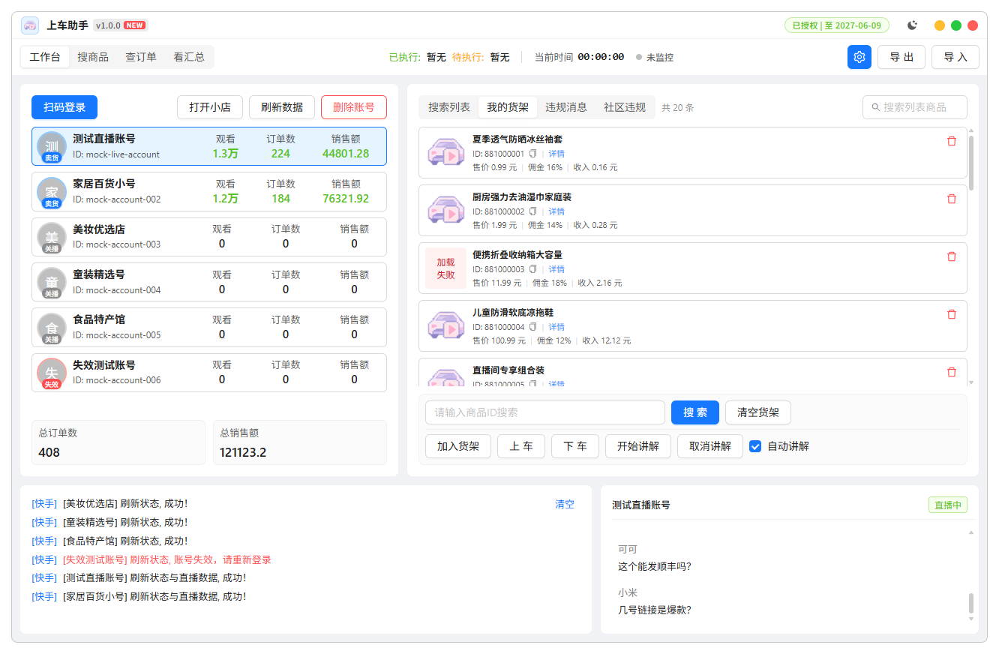

## 功能说明

### 工作台 · 录播定时上下车

提前把整场直播要做什么排好，到点自动执行。

- **设时间**：填几时几分几秒触发，选好执行账号，点「开始」计时
- **加操作**：选「上车」「下车」「开始讲解」「取消讲解」等，再选对应商品
- **管列表**：可以编辑、删除、清空；换商品了用「换商品」一键批量替换
- **开监控**：排好后点「开始监控」，软件跟着时间自动跑

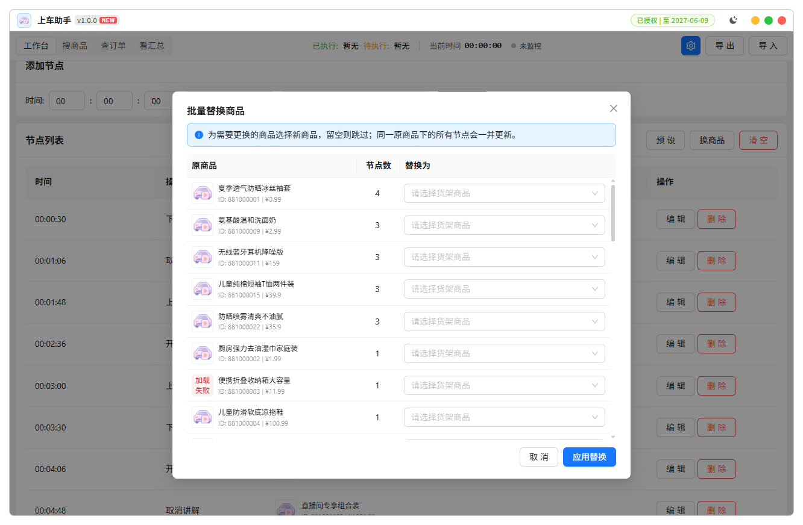

开播下播等固定点击，可以用「预设」提前录好（鼠标移到位置按 **F4** 抓取，再添加步骤）：

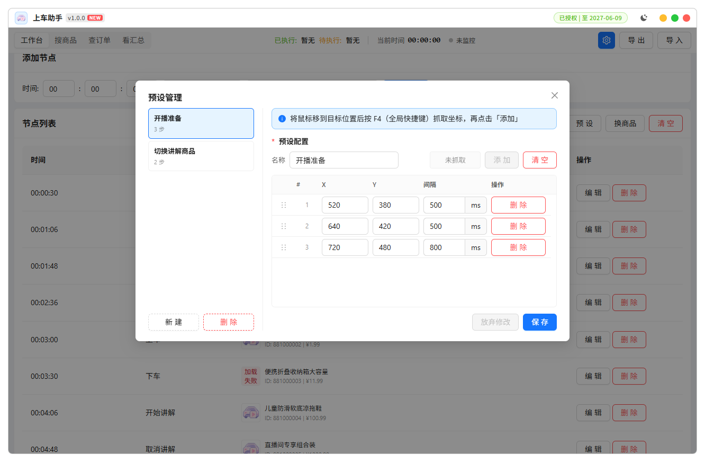

排好的场次可以点右上角「导出」备份，下次「导入」直接用，不用重新配。

### 我的货架 · 手动控车（真人直播常用）

- 搜商品 ID，一键上车、下车、开始讲解、取消讲解
- 勾选「自动讲解」，上车时自动开始讲解
- 底部有操作日志，成功失败一目了然

### 搜商品

按账号搜索商品，看价格、佣金和商品 ID，排期或直播前查品都方便。

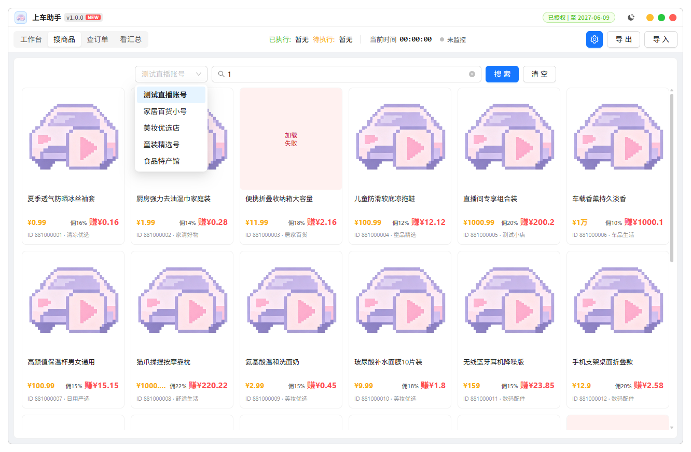

### 查订单

按账号、时间、订单状态筛选，还能导出表格，方便对账。

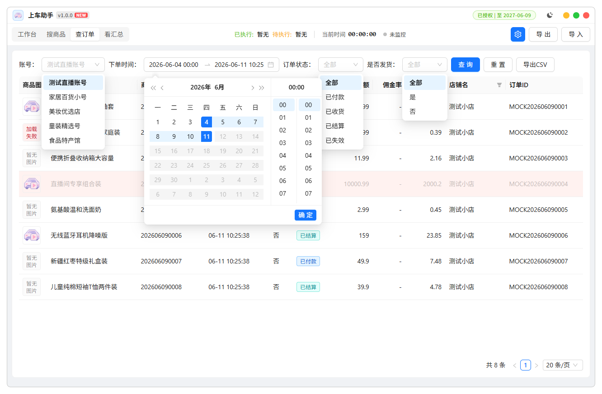

### 看汇总

选时间段，看卖了多少钱、多少单、佣金多少、退了多少，还能按商品看明细。

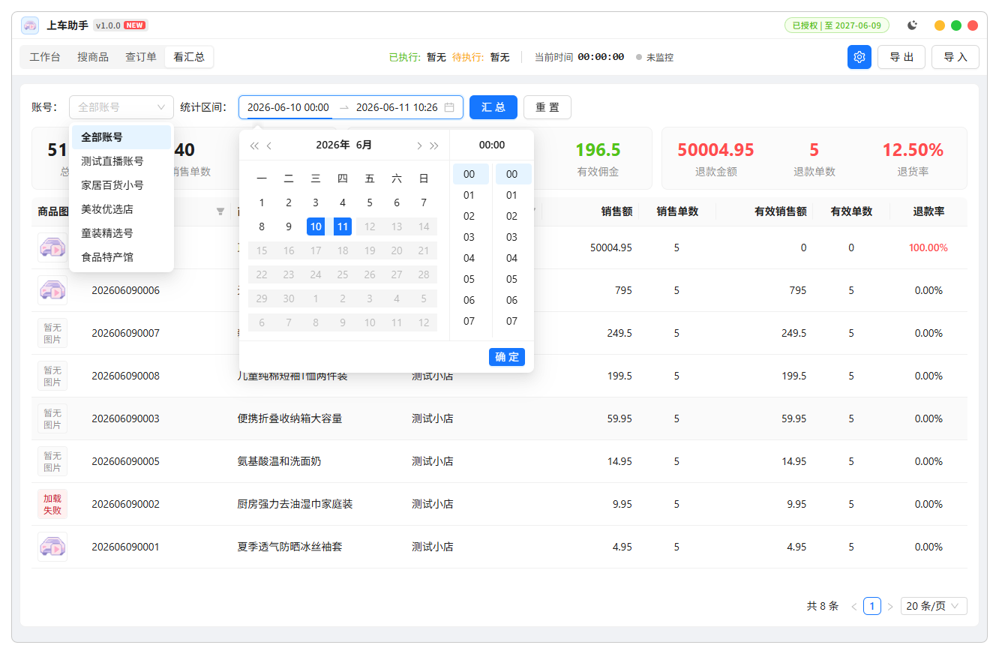

### 跟播助手

直播时开小窗看弹幕，回复观众。常用话术可以设成快捷回复，点一下就能发，最多 100 条。

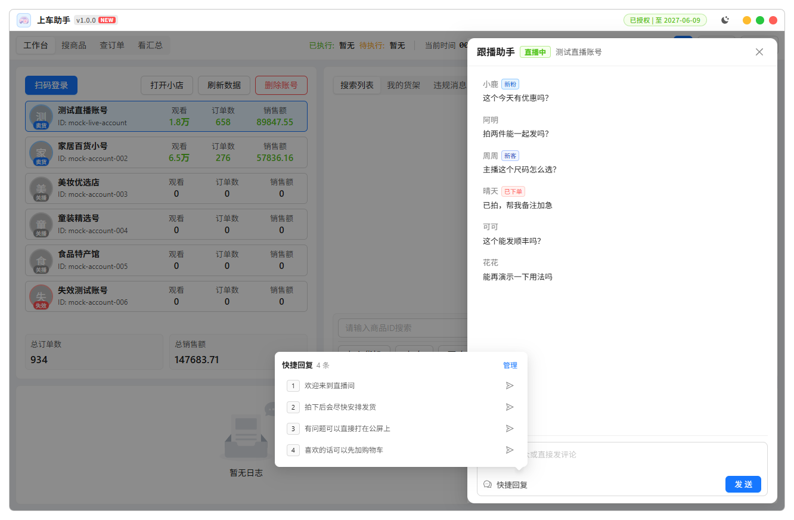

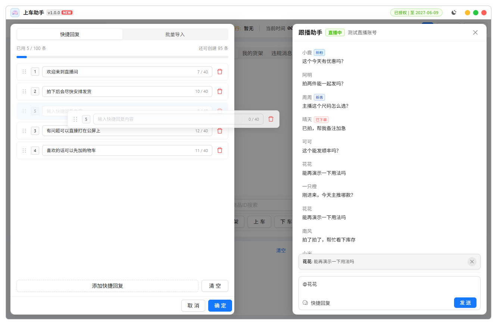

### 设置

点右上角齿轮：

- **全局参数**：刷新间隔等常规选项
- **语音播报**：操作成功或失败时语音提醒，可设只报失败、只报定时任务

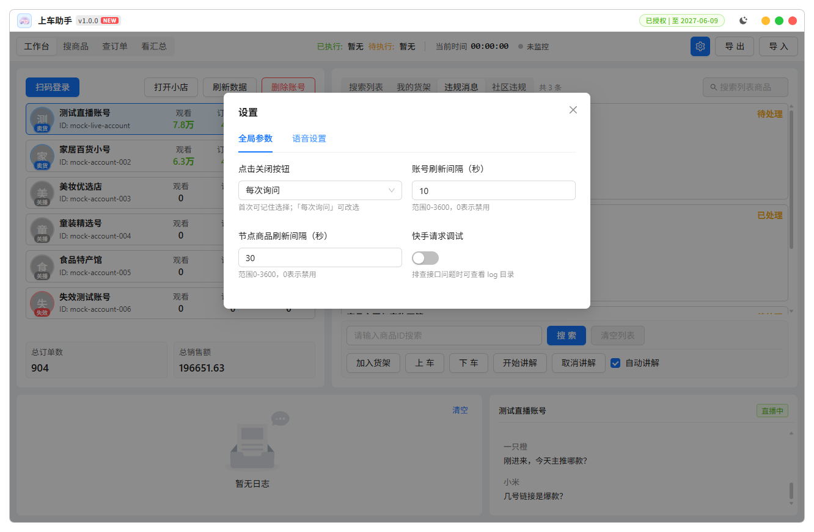

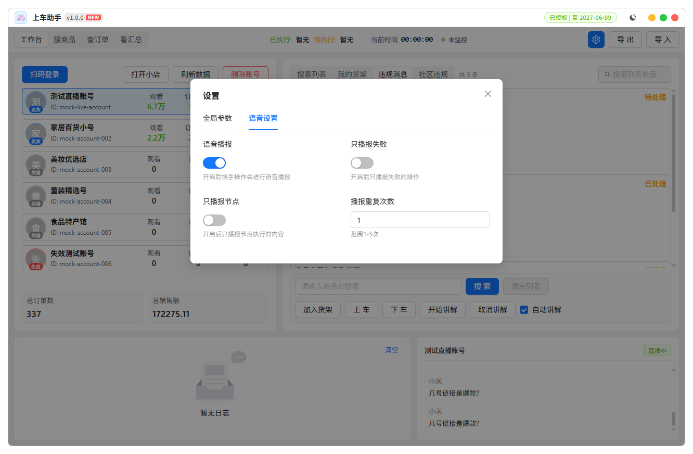

## 常见问题

**激活不了 / 提示授权失效？**

- 检查激活码有没有输错、有没有过期
- 确认电脑能正常上网
- 提示已绑定其他电脑：一个激活码只能绑一台电脑

**突然提示未授权？**

- 可能激活码到期或被注销，也可能离线太久，重新激活或联系客服

**扫码登录失败 / 账号显示失效？**

- 重新扫码登录就行，快手登录过期比较常见

**到了时间没有自动上下车？**

- 定时功能只适用于**录播**，真人直播请用手动操作
- 确认已点「开始监控」，时间轴上有对应操作
- 账号必须**正在直播中**，没开播操作不了
- 检查商品 ID 对不对、账号有没有失效

**手动操作也失败？**

- 先确认选对了账号，账号没有失效
- 网络不好或快手限流时，等一会儿再试

**更新后配置没了？**

- 如果装到了新文件夹，旧配置还在原来的安装目录，把里面的 `data` 文件夹和 `license` 文件复制到新安装目录即可

## 联系我们

使用问题、申请激活码：

- 邮箱：[Ruoms@qq.com](mailto:Ruoms@qq.com)
- QQ：153336174
- 微信：Ruomsu
